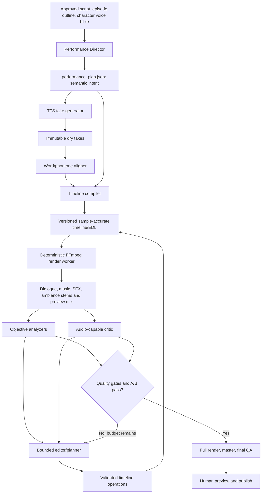

# Agentic Cinematic Audio Editor for POCKET_FM

> Status: the fast post-TTS editor described below is implemented as of 2026-07-26. The later sections remain the production-grade roadmap for word alignment, durable revision history, objective QA, and an audio-listening critic.

## Implemented fast path

The application now generates each non-empty dialogue line once and keeps those WAV files as immutable source takes. One lightweight `SoundPlan` pass receives the script plus measured clip durations, then chooses bounded edits for pauses, playback rate, dialogue gain, actual voiced overlap/interruption, ambience, music, dialogue-driven ducking, and SFX. The deterministic Pydub renderer rebuilds the timeline and final master from those existing files; it never calls TTS while mixing.

In the normal Generate Episode job this is the explicit final `cinematic` stage after voice rendering. The job does not become ready—and the Ideaboard does not navigate to the Episode page—until the directed timeline has been rendered and mastered successfully.

After the first render, the Episode screen exposes an **Audio Director**. The creator can listen, choose a preset or type a direction such as “make the argument tighter, dip the score harder under speech, then build into the reveal,” and select **Remix existing voices**. That background job performs one directing call and one local mix. It does not rewrite the script or regenerate a voice, so iterative changes are fast.

The current implementation includes:

- True speech overlap and interruption timing rather than subtracting from a generic pause.
- Per-line pause-before, pause-after, rate, and gain edits with defensive bounds.
- Light edge-silence trimming while preserving the immutable source files.
- Scene-length looped ambience, sparse line-anchored SFX, gain, and stereo pan.
- Music cue gain/fades plus adjustable speech-aware duck depth, attack, hold, and release.
- Cue retiming after dialogue edits, followed by a fast peak-safe master.
- A no-TTS remix endpoint, background job, cache-busted preview, presets, and free-text direction UI.
- Regression tests proving source WAVs remain unchanged and remixing never invokes script generation or TTS.

Still intentionally deferred from the full design are word-level alignment, a real multibus DAW engine, versioned/A-B revision storage, LUFS/true-peak measurement, and a multimodal critic that independently listens to the render. Those are valuable next steps, but they are not required for the quick creator feedback loop now in the product.

## Executive recommendation

The best approach is to give the LLM a **small, typed, non-destructive audio workstation API**. The LLM should direct performances and request bounded timeline edits; deterministic code should synthesize takes, align words, place clips, mix buses, measure the result, and render audio. An independent audio-capable critic should then hear short previews and return approximate time-/line-coded problems. The editor resolves them to canonical anchors, applies the smallest valid patch, renders an A/B preview, and repeats within a strict quality and cost budget.

Do not give the model arbitrary filesystem access, raw waveform mutation, a DAW GUI, or the ability to invent shell/FFmpeg commands. The source of truth should be a versioned edit decision list (EDL) expressed as validated JSON. FFmpeg or an equivalent DSP engine compiles that JSON into audio reproducibly.

The repository does not need a total rewrite. Keep these useful foundations:

- The story, episode, character, and `ScriptLine` pipeline.
- The existing `ScriptLine.id` field, positional line handling, and per-line source-audio pattern. Truly stable IDs still need to be introduced and migrated before they can anchor edits.
- Structured Pydantic outputs.
- TTS retries, parallel lanes, and content caching.
- Atomic file-based episode artifacts.
- Sparse sound-design restraint.

Replace or extend these parts:

- Replace fixed serial concatenation with a multitrack, sample-accurate timeline.
- Replace the very small `SoundPlan` with a semantic performance plan plus a compiled production timeline.
- Replace fixed music attenuation with manual score automation plus dialogue-driven ducking.
- Add immutable takes, word alignment, stems, buses, mastering, objective QA, revisions, and a listen/revise loop.
- Replace script-only evaluation with separate script evaluation and actual audio evaluation.

The highest-value first slice is:

1. A versioned timeline/EDL.
2. Per-line pauses, gain, speed, fades, overlap, and interruption.
3. Real dialogue-controlled music ducking.
4. An audio-listening critic that can revise a short preview.

That slice directly unlocks the requested features without first building a full general-purpose DAW.

---

## 1. Baseline process before the fast editor

### 1.1 The active production route

There are currently two orchestration paths:

- The older LangGraph chain declares `script -> voice_cast -> audio -> sound_design -> mix` in `app/graph.py:20-49`.
- The active React flow intentionally stops that chain at `episode_plan` in `frontend/src/api/flow.js:20-32`. Episodes are then produced individually through `POST /studio/series/{series_id}/episodes/{number}/generate` in `app/api_store.py:249-265`.

The active per-episode process in `app/episode_service.py:33-88` is:

```text
existing/new script
    -> render one TTS WAV per non-empty line
    -> concatenate every line with the same 350 ms gap
    -> ask an LLM for sparse music/SFX cues indexed by line
    -> overlay fixed-level music and SFX
    -> run a text-only script evaluator
    -> save one final WAV
```

Jobs run in daemon threads and job state exists only in memory (`app/jobs.py:1-9,69-95`). The artifacts are durable, but the orchestration and revision history are not.

### 1.2 Current speech generation

`app/nodes/audio.py:44-109` performs the following work:

1. Filters out empty script lines.
2. Resolves one Gemini voice for each speaker.
3. Prefixes the text with one bracketed emotion when present.
4. Generates each line independently through `app/tts.py`.
5. Restores script order after parallel synthesis.
6. Calls `audio_engine.concat_lines()`.
7. Saves one flattened `epNN_voices.wav` plus coarse line offsets.

`app/audio_engine.py:19-35` inserts exactly `PAUSE_BETWEEN_LINES_MS`, currently 350 ms (`app/config.py:99`), between all lines. This means a whispered confession, a courtroom exchange, an argument, narration, and a hard interruption all receive the same turn-taking behavior.

The TTS cache is a good idea, but its key currently contains only `model | voice | text` (`app/tts.py:189-191`). Once performance direction is added, the key must also contain the complete direction, character profile, scene context, pronunciation settings, language, output format, provider version, and seed when a provider supports one.

Two current identity/casting details must be fixed before a timeline can safely depend on them:

- `ScriptLine.id` defaults to an empty string, and the current save normalization uses `setdefault`, which does not replace an existing blank ID (`app/schemas.py:148-150`, `app/store.py:350-362`). The backend and frontend therefore fall back to positional IDs. Those fallbacks change when a line is inserted, removed, reordered, or regenerated; they are not stable production anchors.
- The active React flow stops before the graph's `voice_cast` stage. Unless a creator manually selects a voice, `_voice_for()` uses Charon for the narrator and a deterministic hash fallback for other speakers (`app/nodes/audio.py:28-38`). That can reuse a voice and ignores the richer casting prompt. The new production path needs an explicit, persisted casting/voice-bible step before generating takes.

Introduce immutable UUID/ULID-style line and scene IDs. Preserve them through ordinary edits. When a whole script is regenerated, reconcile old and new lines using scene membership, speaker, neighboring lines, and text similarity; preserve high-confidence matches and assign new IDs only to unmatched lines. Never use a content hash alone as the ID because correcting the text would then change the anchor.

TTS throughput also constrains the agent design. The current default is a 21-second minimum interval per configured key, and parallel workers are capped to available configured keys (`app/config.py:89-97`). Ignoring synthesis latency and retries, a one-key 60-line episode has a lower bound of roughly 21 minutes for one take per line; generating two takes for every line roughly doubles that. The harness must calculate expected requests before starting, respect provider quotas, prefer one take for routine lines, request alternates only for pivotal/failed lines, and require an appropriate paid quota or explicit creator approval for large jobs.

### 1.3 Current sound design and mix

The current contract can express only:

- A music mood spanning a start line and end line.
- An SFX name placed at the start of one line.

See `app/schemas.py:184-204` and `app/prompts.py:216-236`.

There is also a disconnected duplicate source of sound intent: `ScriptLine` contains `sfx` and `music` hint fields (`app/schemas.py:157-164`), but `prompts.sound_design()` sends only line type, speaker, and text to the sound planner. Those hints are therefore not reliably consumed. The migration should reconcile them once into the semantic performance/scene plan and then deprecate the competing representation.

`app/nodes/audio.py:122-164` turns those line indices into offsets and enforces useful restraint: known assets only, SFX spacing, non-overlapping music cues, and a total music-coverage cap. Those principles should survive in the new system.

However, the current “ducking” is not actually speech-reactive ducking. `app/audio_engine.py:45-55` simply attenuates a music bed by a constant `-16 dB` throughout the cue, adds a fade at the cue boundaries, and overlays it onto the already-flattened voice track. SFX is similarly overlaid at a fixed `-6 dB` (`app/audio_engine.py:58-62`). Pydub overlays preserve the base voice-track duration, so an effect or reverb tail near the end can be truncated. There are no dialogue, music, ambience, SFX, reverb, or master buses.

The current manifest's `segment.end_ms` is the next line's start, so it includes the 350 ms inter-line gap rather than representing the true speech end (`app/nodes/audio.py:89-98`). A production timeline must store source speech bounds, editorial pause, and resolved next-clip position separately.

### 1.4 Current evaluation does not hear the result

`story_service.evaluate_episode()` sends the blueprint, outline, and script to the evaluator. The prompt in `app/prompts.py:260-270` contains no rendered audio. Consequently the evaluator cannot detect:

- An awkward or overly long pause.
- A clipped word or SFX tail.
- Unnatural delivery.
- Music masking a whisper.
- A bad loop seam.
- Excessive compression, pumping, or clipping.
- Stereo balance or scene-to-scene loudness jumps.
- Whether an intended interruption sounds believable.

The frontend in `frontend/src/pages/Episode.jsx` can play, seek, download, and edit speaker/text/emotion. Its displayed waveform is decorative rather than derived from the audio, and it has no timeline, revisions, stems, A/B comparison, or time-coded critique interface.

### 1.5 Current asset and delivery ceiling

The bundled sound library is now a versioned, licensed pack. Eight Mixkit music
tracks cover the closed mood vocabulary; twelve Mixkit effects cover the standard
event keys; and three CC0 Freesound recordings provide apartment room tone,
post-crying breath detail, and ceramic mug clinks. Exact source, license, creator,
and restoration URLs live in `assets/sound_manifest.json` and
`assets/library/v2/SOURCES.md`. `tools/build_assets.py` verifies or restores this
pack and can no longer recreate synthetic placeholders.

The current speech and final mix are based on 24 kHz, 16-bit mono audio (`app/config.py:83-102`). A representative saved episode inspected in `output/9450d9c6e25b/episodes/ep01` is 112.388 seconds, 24 kHz mono, approximately -18.17 LUFS integrated with -1.09 dB true peak. That is useful as a baseline measurement, not as an approved house specification. Because `output/` is not a durable tracked test fixture, Phase 0 should preserve a licensed/synthetic golden sample, the exact measurement command, and its QA JSON inside a tracked test-fixture location.

### 1.6 Gap analysis

| Requested behavior            | Current representation       | Why it cannot work reliably today                                                   |
| ----------------------------- | ---------------------------- | ----------------------------------------------------------------------------------- |
| Natural variable pauses       | One global 350 ms gap        | No per-line, internal, scene, or dramatic pause model                               |
| Hard interruptions            | Serial concatenation         | The next clip cannot start before the current one ends or cut it at a word boundary |
| Overlapping speech            | One flattened dialogue track | No speaker lanes, dominance, overlap roles, or independent gain                     |
| Dialogue speed                | TTS prompt text only         | No pace contract, measured speaking rate, or pitch-preserving correction            |
| Dialogue volume               | One source level             | No clip gain, character trim, automation, dialogue bus, or headroom policy          |
| Music dip during speech       | Constant`-16 dB` bed       | No dialogue envelope, sidechain, hold, release, or anticipatory duck                |
| Music rise on emotional beats | One constant cue level       | No score automation keyframes, hit points, or transition logic                      |
| Cinematic space               | Mono overlay                 | No ambience beds, room tone, reverb sends, stereo placement, or tails               |
| Agent listens and fixes       | Script-only evaluation       | The model never receives the produced audio or objective measurements               |
| Cheap local revision          | Whole flattened mix          | No dependency graph, dirty region, immutable take, or revision-based preview        |

---

## 2. What “extremely good” should mean

“Cinematic” should not mean constant music, constant effects, shouting, or crosstalk. It should mean intentional performance, precise pacing, intelligible dialogue, convincing space, musical storytelling, and restraint.

Quality needs four independent layers:

1. **Writing and direction** — subtext, emotion, character identity, turn-taking intent, and scene shape.
2. **Source performances and assets** — good TTS takes, correct pronunciation, high-quality score/SFX/ambience, and valid licensing.
3. **Editorial construction** — word-aware cuts, pauses, overlap, fades, timing, take selection, and scene transitions.
4. **Mix and mastering** — buses, dynamics, ducking, spatial coherence, loudness, true peak, and delivery encoding.

The LLM is strongest at layer 1 and subjective review. Deterministic audio code is strongest at layers 3 and 4. Layer 2 requires good source models and a curated asset library. The system should use each component for the work it can verify.

### Suggested initial house profile

Make all targets configurable by delivery profile rather than hard-coding one global master.

For a Pocket-FM-style podcast/streaming profile, a sensible starting point is:

- Work internally at 48 kHz stereo with floating-point DSP.
- Preserve immutable dry dialogue takes.
- Produce a 48 kHz, 24-bit stereo WAV master and encoded delivery derivatives.
- Target approximately -16 LKFS/LUFS integrated, within ±1 LU.
- Keep maximum true peak at or below -1 dBTP.
- Keep dialogue clearly intelligible on phone speakers and in noisy environments.
- Keep Loudness-to-Dialogue Ratio at or below 5 LU unless a platform specification or deliberate approved creative choice says otherwise.

Apple’s podcast guidance recommends audio near -16 dB LKFS with ±1 dB tolerance and a true peak no higher than -1 dBFS, measured using ITU-R BS.1770-5 ([Apple Podcasts audio requirements](https://podcasters.apple.com/support/893-audio-requirements)). ITU-R BS.1770-5 is the in-force programme loudness and true-peak measurement recommendation ([ITU-R BS.1770-5](https://www.itu.int/rec/R-REC-BS.1770-5-202311-I)). EBU’s cinematic-content guidance recommends measuring Programme Loudness, Dialogue Loudness, Loudness-to-Dialogue Ratio, and maximum true peak, and recommends that LDR not exceed 5 LU for adapted cinematic delivery ([EBU R 128 s4](https://tech.ebu.ch/docs/r/r128s4.pdf)).

These are delivery and measurement anchors, not a reason to flatten every whisper and shout. Measure dialogue separately and preserve intentional dynamics inside an approved range.

---

## 3. Target architecture



### 3.1 Component responsibilities

#### Performance Director

Reads the script, episode outline, character profiles, prior-scene state, and intended dramatic arc. It emits semantic intent, not guessed absolute timestamps:

- Speaking objective and subtext.
- Emotion and intensity.
- Pace and energy.
- Projection/distance and breathiness.
- Important words and pronunciation notes.
- Pause intent.
- Turn-taking mode.
- Whether one line interrupts, overlaps, trails, or reacts to another.
- Score and ambience intent at scene level.

The current script is a flat line list, so first persist a revisioned `scene_map` with stable scene IDs, ordered line membership, location, time, room profile, and transition intent. Preview bounds, ambience, edit safety, and dirty-region invalidation must refer to that map rather than asking the model to rediscover scenes on every run.

#### Take generator

Creates one default take for ordinary lines and a small number of alternates only for pivotal lines. Takes are immutable assets. Replacing a take selects a different asset; it never overwrites a WAV that an old revision references.

#### Aligner

Aligns the known transcript to the generated take and emits word/phoneme boundaries. This is essential for believable interruption cuts, word-anchored SFX, internal pauses, and accurate UI highlighting. Because the transcript is already known, forced alignment is more appropriate than asking ordinary ASR to rediscover it.

[Montreal Forced Aligner](https://montreal-forced-aligner.readthedocs.io/en/latest/user_guide/workflows/alignment.html) is an open option and its alignment workflow can emit JSON, CSV, or TextGrid. [WhisperX](https://github.com/m-bain/whisperX) is another practical word-timestamp option. Treat the aligner as a replaceable, version-pinned worker; heavy ML dependencies may be easier to isolate in a Python 3.11/container worker while the current project virtual environment remains on Python 3.13.

#### Timeline compiler

Resolves semantic anchors after the real take duration and alignment are known. It converts “interrupt after the seventh word, begin 120 ms early” into integer project-rate PCM-frame positions, source trims, fades, automation, and bus routing.

#### Render worker

Accepts only validated timeline data. It never accepts a model-authored command string. It maps allow-listed fields to a deterministic DSP graph and emits stems, previews, and technical logs.

#### Objective analyzer

Measures facts: duration, loudness, true peak, clipping, silence, overlap, speech rate, dialogue-to-music balance, transcript coverage, missing assets, and tail truncation. These values must not be delegated to a subjective model.

#### Audio critic

Receives actual preview audio plus the intended scene, transcript, timeline excerpt, and analyzer report. It judges performance, pacing, naturalness, emotional progression, masking, transitions, mono-compatible ambience/reverb character, and dramatic impact. It returns approximate time-coded evidence rather than a generic score. Stereo imaging and exact spatial balance require channel-preserving analyzers and human review when the configured critic downmixes its input.

#### Editor/planner

Translates accepted issues into the smallest valid set of domain operations. It must dry-run the operations, render A/B, and keep the edit only when the target issue improves without breaking a hard gate.

---

## 4. Two-level edit representation

Do not force the LLM to guess absolute milliseconds before speech exists. Store two linked representations.

### 4.1 Semantic performance plan

Before creating this plan, migrate every line to an immutable ID and persist a revisioned scene map. The logical `performance_plan` is also versioned/content-addressed; the filename shown here is a concept, not one mutable file that gets overwritten. It describes intent using stable IDs and word-relative anchors:

```json
{
  "schema_version": "1.0",
  "episode_id": "ep01",
  "plan_revision": 4,
  "scene_map_revision": 2,
  "scenes": [
    {
      "scene_id": "scene-03",
      "location": "empty hospital corridor at night",
      "room_profile": "long_hard_corridor",
      "ambience_intent": "quiet HVAC, distant trolley, no wall-to-wall score",
      "score_intent": {
        "mood": "dread",
        "entry": "after line-0040",
        "rise_on": "line-0044",
        "exit": "hard cut after line-0046"
      },
      "lines": [
        {
          "line_id": "line-0041",
          "speaker_id": "maya",
          "delivery": {
            "objective": "hide fear while buying time",
            "emotion": "fear",
            "intensity": 0.62,
            "pace": 0.94,
            "energy": 0.48,
            "projection": "close",
            "important_words": ["door", "locked"],
            "notes": "controlled breath; do not sound melodramatic"
          },
          "turn_taking": {
            "mode": "normal",
            "pause_before_ms": 180,
            "pause_after_ms": 80
          },
          "internal_events": [
            {
              "event_id": "pause-0041-a",
              "type": "pause",
              "anchor": {"kind": "word_end", "word_index": 4},
              "duration_ms": 210
            }
          ],
          "allowed_vocal_events": [
            {
              "event_id": "breath-0041-a",
              "type": "breath",
              "anchor": {"kind": "before_word", "word_index": 5},
              "required": false
            }
          ]
        },
        {
          "line_id": "line-0042",
          "speaker_id": "arjun",
          "delivery": {
            "objective": "stop the lie immediately",
            "emotion": "anger",
            "intensity": 0.86,
            "pace": 1.05,
            "energy": 0.82,
            "projection": "across_room",
            "important_words": ["No"],
            "notes": "sharp entry, then contain the anger"
          },
          "turn_taking": {
            "mode": "hard_interrupt",
            "target_line_id": "line-0041",
            "anchor": {
              "kind": "word_end",
              "word_index": 7
            },
            "offset_ms": -140,
            "cut_target": true,
            "target_tail_ms": 70,
            "primary_speaker": "arjun"
          }
        }
      ]
    }
  ]
}
```

Recommended turn-taking modes:

- `normal` — one speaker ends, then a natural gap.
- `gap` — an intentionally specified dramatic silence.
- `latched` — the next line begins almost immediately after the previous line.
- `cooperative_overlap` — agreement, reassurance, finishing a thought, or natural crosstalk.
- `hard_interrupt` — the new speaker cuts off the target at a verified word boundary.
- `trailing_overlap` — the next line begins over the previous speaker’s final phrase/tail.
- `backchannel` — short “mm,” “yes,” laugh, breath, or reaction under a primary line.
- `simultaneous_reaction` — a brief planned joint response, normally with no more than two intelligible foreground speakers.

Typed vocal events distinguish an allowed breath, laugh, sigh, gasp, cough, or backchannel from an unwanted transcript deviation. Each event has an ID, type, anchor, optional spoken/nonlexical token, and required/optional status. Transcript QA verifies lexical dialogue exactly and checks planned nonlexical events separately; it must not treat an approved laugh as a hallucinated word or allow arbitrary extra speech under the label “reaction.”

### 4.2 Compiled `timeline.json`

After synthesis and alignment, ingest sources into a canonical project-rate asset and resolve all edits to integer PCM frames. One frame contains one sample value per channel, avoiding the ambiguity of “sample” for stereo audio:

```json
{
  "schema_version": "1.0",
  "project_id": "series-123/ep01",
  "revision": 12,
  "parent_revision": 11,
  "format": {
    "sample_rate": 48000,
    "channels": 2,
    "working_sample_format": "fltp"
  },
  "assets": {
    "take-line-0041-v2": {
      "kind": "dialogue_take",
      "relative_path": "assets/7c/7c4d...wav",
      "sha256_pcm": "7c4d...",
      "duration_frames": 150000,
      "ingested_sample_rate": 48000,
      "original_source_sample_rate": 24000,
      "speaker_id": "maya",
      "line_id": "line-0041"
    },
    "take-line-0042-v1": {
      "kind": "dialogue_take",
      "relative_path": "assets/18/18a2...wav",
      "sha256_pcm": "18a2...",
      "duration_frames": 145000,
      "ingested_sample_rate": 48000,
      "original_source_sample_rate": 24000,
      "speaker_id": "arjun",
      "line_id": "line-0042"
    }
  },
  "tracks": [
    {"id": "dlg-maya", "kind": "dialogue", "bus": "dialogue"},
    {"id": "dlg-arjun", "kind": "dialogue", "bus": "dialogue"},
    {"id": "amb-scene-03", "kind": "ambience", "bus": "environment"},
    {"id": "score", "kind": "music", "bus": "music"}
  ],
  "clips": [
    {
      "id": "clip-line-0041",
      "line_id": "line-0041",
      "asset_id": "take-line-0041-v2",
      "track_id": "dlg-maya",
      "timeline_start_frame": 812160,
      "source_in_frame": 1920,
      "source_out_frame": 134400,
      "rate": 0.97,
      "preserve_pitch": true,
      "gain_db": -0.8,
      "pan": 0.0,
      "fade_in_frames": 576,
      "fade_out_frames": 2400,
      "role": "interrupted_target"
    },
    {
      "id": "clip-line-0042",
      "line_id": "line-0042",
      "asset_id": "take-line-0042-v1",
      "track_id": "dlg-arjun",
      "timeline_start_frame": 942000,
      "source_in_frame": 960,
      "source_out_frame": 136320,
      "rate": 1.02,
      "preserve_pitch": true,
      "gain_db": 0.7,
      "pan": 0.0,
      "fade_in_frames": 480,
      "fade_out_frames": 1440,
      "role": "interrupting_primary"
    }
  ],
  "buses": {
    "dialogue": {
      "effect_preset": "dialogue_natural_v1",
      "target_loudness_role": "anchor"
    },
    "music": {
      "automation": [
        {"frame": 720000, "gain_db": -20.0},
        {"frame": 912000, "gain_db": -14.0},
        {"frame": 942000, "gain_db": -24.0}
      ],
      "ducking": {
        "key_bus": "dialogue",
        "preset": "dialogue_clear_v1",
        "max_reduction_db": 12.0,
        "attack_ms": 12,
        "hold_ms": 180,
        "release_ms": 480
      }
    }
  },
  "master_tail_frames": 144000
}
```

### 4.3 Timeline invariants

The validator, not the model, must enforce these invariants:

- All timeline-frame positions, source-frame bounds, and fades are non-negative and within the referenced canonical ingested asset.
- Internally use integer project-rate PCM frames, never accumulating floating-point milliseconds or mixing native-source units with project units.
- Each edit references stable line, clip, track, asset, scene, and revision IDs.
- Assets are immutable and content-addressed.
- A hard interruption may cut only at a verified alignment boundary or an explicitly human-approved fallback.
- No critical word may be hidden by an unapproved overlap.
- Foreground simultaneous speakers are bounded, normally to two.
- Rate, gain, fades, overlap, pan, automation slope, and effect parameters stay inside product limits.
- Every music/SFX/ambience asset has a valid license/provenance entry.
- Previews include handles so reverb, compression, and ducking state are correct at preview edges.
- The final master is long enough to contain approved SFX, ambience, music, and reverb tails.

---

## 5. The LLM-facing audio editor API

The agent should receive a small tool surface with structured inputs and outputs. The tools should be domain operations, not generic JSON Patch and not raw DSP strings.

### 5.1 Read and analysis tools

| Tool                                                        | Purpose                                                                    |
| ----------------------------------------------------------- | -------------------------------------------------------------------------- |
| `get_project_summary(episode_id)`                         | Script hash, scenes, cast, active revision, render status, quality profile |
| `get_scene_intent(scene_id)`                              | Dramatic goal, location, character state, performance plan                 |
| `get_timeline(revision, start, end, tracks)`              | Only the relevant EDL slice rather than the whole project                  |
| `inspect_clip(clip_id)`                                   | Take, transcript, alignment, source bounds, effects, dependencies          |
| `get_alignment(line_id, take_id)`                         | Word/phoneme boundaries and confidence                                     |
| `list_assets(kind, query, tags, license)`                 | Search allow-listed score/SFX/ambience assets                              |
| `render_preview(revision, start, end, stems, handles_ms)` | Render a short, cacheable preview and requested stems                      |
| `analyze_audio(render_id, region)`                        | Objective metrics and hard-gate failures                                   |
| `listen_preview(render_id, rubric)`                       | Send actual audio to the configured audio critic                           |
| `compare_previews(render_a, render_b, rubric, blind)`     | Pairwise comparison plus metric deltas                                     |
| `get_revision_diff(old_revision, new_revision)`           | Canonical before/after edit summary                                        |

### 5.2 Mutation tools

| Tool/operation            | Allowed effect                                                                                                      |
| ------------------------- | ------------------------------------------------------------------------------------------------------------------- |
| `request_takes`         | Generate bounded alternate takes for selected line IDs                                                              |
| `select_take`           | Point a clip to an immutable existing take                                                                          |
| `set_line_timing`       | Change pause, latch, overlap, or semantic anchor                                                                    |
| `insert_internal_pause` | Split a clip at an aligned word/phoneme boundary, shift the tail, add edge fades, and preserve room tone in the gap |
| `move_clip`             | Move a clip inside safe scene bounds                                                                                |
| `trim_clip`             | Change source in/out only at safe boundaries                                                                        |
| `set_clip_rate`         | Apply a bounded pitch-preserving rate correction                                                                    |
| `set_clip_gain`         | Change clip trim gain inside configured limits                                                                      |
| `set_fades`             | Add click-safe edge fades                                                                                           |
| `set_automation`        | Change bounded track/bus automation points                                                                          |
| `set_bus_ducking`       | Select or tune a safe ducking preset                                                                                |
| `set_effect_preset`     | Select an allow-listed voice/room/bus preset                                                                        |
| `place_asset`           | Place a known music/SFX/ambience asset at a semantic or aligned anchor                                              |
| `remove_timeline_item`  | Remove an edit item, never delete the underlying source asset                                                       |
| `create_snapshot`       | Name a reversible revision                                                                                          |
| `revert_revision`       | Create a new revision whose content is cloned from an older revision; never rewrite or delete history               |
| `promote_revision`      | Mark a reviewed revision as the candidate master                                                                    |

### 5.3 Mutation transaction contract

Every mutation should contain:

```json
{
  "base_revision": 12,
  "idempotency_key": "critic-pass-2-issue-7",
  "dry_run": true,
  "operations": [
    {
      "type": "set_bus_ducking",
      "bus_id": "music",
      "region": {"start_ms": 18200, "end_ms": 23700},
      "changes": {"max_reduction_db": 14.0, "release_ms": 560}
    },
    {
      "type": "set_clip_gain",
      "clip_id": "clip-line-0042",
      "gain_db": 0.2
    }
  ]
}
```

The response should contain:

- New revision number, or a dry-run candidate ID.
- Canonical normalized operations.
- Validation warnings and rejected operations.
- Exact affected project-frame/time range including render handles.
- Invalidated cache nodes.
- Cost estimate for any TTS work.
- Before/after objective metrics when a preview is requested.
- A render ID that can be heard and compared.

Use optimistic concurrency: an operation against stale `base_revision` must fail with a useful diff instead of silently overwriting newer work. Keep an append-only edit log and immutable revision snapshots.

### 5.4 Authority boundaries

The automatic editor may safely change bounded timing, gain, fades, take selection among approved takes, ducking, known asset placement, and safe effect presets.

Require explicit human approval before it:

- Rewrites spoken words or removes story content.
- Changes speaker identity or recasts a character.
- Uses a new external/licensed asset.
- Alters a critical plot word through a hard interruption.
- Publishes the master.
- Exceeds the normal resynthesis or iteration budget.

### 5.5 Security, privacy, and isolation

Production previews, stems, scripts, and voice data can be sensitive. The harness needs explicit controls:

- Authenticate every production endpoint and authorize access per series/episode/revision. A render ID alone must never grant access.
- Obtain creator consent before sending audio or scripts to an external TTS/alignment/critic provider; document provider retention/training settings and support a local-only policy where required.
- Define retention and deletion for source recordings, generated takes, previews, stems, provider uploads, caches, and logs. A series deletion must include derived artifacts according to policy.
- Treat script text, character notes, filenames, and asset metadata as untrusted content, not instructions. Delimit them in prompts, never allow embedded text to expand tool authority, and validate every returned operation independently.
- Resolve only registry asset IDs; reject absolute paths from the agent, path traversal, unsupported protocols, and untrusted filter/plugin names.
- Run FFmpeg/alignment workers with least privilege, isolated temporary directories, file-size/duration limits, CPU/memory/time quotas, bounded concurrency, and no unnecessary network access.
- Keep API secrets out of manifests/logs and audit every external provider request, mutation, approval, export, and deletion.
- Use signed/authorized download routes or short-lived URLs for previews and stems; never expose the workspace path.
- Scan/validate uploaded media before decoding and cap probe/decode work to reduce malformed-media and resource-exhaustion risk.

---

## 6. Feature implementation details

### 6.1 Expressive TTS and take generation

The current prompt passed to TTS is effectively `[emotion] text`. That discards the rich `vocal_signature` and `vocal_direction` already produced for characters in `app/schemas.py:91-108`.

Build each performance prompt from:

1. **Audio profile** — stable character identity, age/presentation, baseline pace, pitch impression, accent, vocal texture, verbal habits, and pronunciation lexicon.
2. **Scene** — location, physical distance, emotional state, preceding action, relationship, and stakes.
3. **Director notes** — objective, subtext, intensity, breath, projection, pace, important words, and what to avoid.
4. **Context only** — previous and next lines, clearly labelled as not to be spoken.
5. **Exact transcript** — clearly delimited as the only lexical words that may be spoken.
6. **Allowed vocal events** — a typed, closed list of optional/required nonlexical events such as a breath, sigh, laugh, or gasp. Unlisted extra words remain a verification failure.

Google’s current TTS guide states that its speech generation can be directed for style, accent, pace, and tone, and recommends audio profile, scene, director notes, and transcript-aware prompting. It also supports inline expressive/audio tags and multi-speaker synthesis for up to two speakers ([Gemini TTS documentation](https://ai.google.dev/gemini-api/docs/speech-generation)).

Recommended hybrid strategy:

- Use separate speaker takes for most production. They are editable, independently alignable, and can overlap deterministically.
- Use native two-speaker generation only as a candidate for selected intimate or rapid exchanges where chemistry matters more than isolated stems.
- Generate one take for routine lines, two for important lines, and at most three for a small number of hero moments.
- Use a faster/cheaper TTS model for rough previews and an optionally higher-fidelity model for approved final takes, but keep both behind the same adapter.
- Preserve the actual selected WAV forever. Preview TTS can be nondeterministic or change across model versions.
- Verify the generated words against the approved transcript before the take can enter the timeline.

Emotion, breathiness, emphasis, pronunciation, and major pace changes belong primarily in synthesis. Exact timing, overlap, gain, fades, and modest speed correction belong in the editor.

### 6.2 Pauses

Represent four different things instead of one global gap:

- `pause_before_ms` and `pause_after_ms` for turn-taking.
- Internal word-anchored pause events for hesitation or realization.
- Scene beats such as `micro`, `short`, `dramatic`, with bounded default ranges.
- A transition gap between scenes.

The compiler should resolve a beat to a starting duration, render it, and allow the critic to adjust it. For an internal pause, `insert_internal_pause` resolves the aligned anchor, splits the source into two clips, adds click-safe boundary fades, shifts the second clip and all dependent anchors, and leaves the scene's room-tone/ambience bus running through the new gap. The operation remains reversible because the source take itself is unchanged.

Pauses should normally contain the scene’s quiet ambience/room tone rather than digital zero. Background score and reverb tails should continue naturally through the pause.

Do not rely on a literal `[pause]` token when timing must be exact. A TTS tag may help the acting, but the deterministic timeline should own the final measured silence.

### 6.3 Dialogue speed

Use this order:

1. Ask TTS for the intended pace.
2. Measure actual words per minute and local pause structure after alignment.
3. Apply only a small editorial rate correction when necessary.
4. Regenerate the take when the required correction is substantial or damages emotion/formants.

A safe initial product range for automatic post-processing is approximately 0.90–1.10, with tighter defaults such as 0.95–1.05. These are starting bounds to calibrate in listening tests, not universal laws.

FFmpeg’s `atempo` adjusts audio tempo, and the installed FFmpeg build also contains the more configurable `rubberband` time-stretching/pitch-shifting filter. Benchmark both on this material rather than assuming one always sounds better. See the official [`atempo`](https://ffmpeg.org/ffmpeg-filters.html#atempo) and [`rubberband`](https://ffmpeg.org/ffmpeg-filters.html#rubberband) documentation. The timeline duration and all downstream anchors must be re-resolved after any rate change.

### 6.4 Dialogue volume and dynamics

Separate controls by purpose:

- **Take trim gain** normalizes raw source differences without erasing performance.
- **Clip gain** makes a local line correction.
- **Character/track trim** keeps one cast member from being consistently too soft/loud.
- **Automation** shapes a word/phrase or physical movement.
- **Dialogue-bus processing** applies gentle shared cleanup and dynamics.
- **Master processing** meets the delivery profile.

Do not loudness-normalize every line to the same value. That would turn whispers, distance, and shouts into the same apparent delivery. Measure them, classify their intended role, and preserve controlled contrast.

A restrained dialogue chain may include a high-pass filter, corrective EQ, de-essing, light compression, and peak control. Use per-character presets only when there is a repeatable need. Keep raw takes available so presets can evolve without resynthesis.

### 6.5 Auto-interruptions and overlapping speech

Believable overlap is an editorial and alignment problem, not just a TTS prompt.

#### Hard interruption algorithm

1. The Director marks an interrupting line and a semantic target/word anchor.
2. Generate both takes separately with full scene context.
3. Forced-align the interrupted take and verify the requested word boundary.
4. Confirm that no protected/plot-critical word is being cut.
5. Trim the interrupted take at the selected word/phoneme boundary.
6. Retain a small natural consonant/breath tail where appropriate.
7. Apply a short click-safe fade rather than an arbitrary sample cut.
8. Start the interrupter slightly before the target ends, commonly around 80–250 ms for a hard verbal barge-in; calibrate per performance.
9. Mark the interrupter as primary and, if needed, reduce the interrupted tail slightly rather than muting it unnaturally.
10. Render dialogue-only and full-mix previews, then check transcript intelligibility and critic feedback.

#### Cooperative overlap algorithm

1. Keep both full phrases unless the script says one is abandoned.
2. Anchor the second entry to a word boundary in the first line.
3. Limit foreground overlap to the intended phrase, commonly a few hundred milliseconds rather than an entire sentence.
4. Mark primary/secondary roles. Use subtle gain priority when necessary.
5. Keep voices near center for phone compatibility; do not solve intelligibility with extreme left/right panning.
6. Re-run ASR/alignment on isolated stems and evaluate the final mix separately.

#### Hard guardrails

- Normally no more than two intelligible foreground speakers.
- Never hide both speakers’ critical words at once.
- Do not overlap narration over important dialogue unless explicitly intended.
- Combined overlap must retain master headroom.
- Do not cut at an unverified character offset.
- Use a human-approved override when alignment confidence is low, especially for names, code-switching, or expressive nonverbal sounds.

### 6.6 Background music dips and emotional rises

Use two independent layers:

#### Layer A: dramatic score automation

The Director chooses meaningful entries, exits, builds, impacts, pauses, and lifts. Store bounded gain keyframes or named curves. Score changes should be scene/beat-aware and, when music metadata supports it, bar/beat-aware.

Examples:

- Enter quietly after a reveal, not simply at the start of a line range.
- Rise in a dialogue-free reaction beat.
- Pull down before a whispered plot point.
- Hit a transition or cliffhanger with a specific musical event.
- Cut to silence when silence has more dramatic value.

#### Layer B: automatic dialogue ducking

Build a dialogue key bus from all speech. Duck the music when the speech envelope is active, with a smooth attack, hold through tiny inter-word gaps, and a release long enough to avoid pumping between syllables. A sensible starting preset might allow 8–14 dB maximum reduction, roughly 5–20 ms attack, 100–250 ms hold, and 300–800 ms release. Tune these against the actual asset and scene.

For an offline renderer, a precomputed ducking envelope is often even better than compressor-only behavior:

1. Derive voiced regions from the aligned dialogue bus.
2. Expand each region slightly before speech and after speech.
3. Merge short inter-word gaps.
4. Smooth the envelope.
5. Combine it with the manual dramatic automation.

This produces an anticipatory dip and avoids music “breathing” on every word. A sidechain compressor can remain as protection on top.

FFmpeg’s [`sidechaincompress`](https://ffmpeg.org/ffmpeg-filters.html#sidechaincompress) uses a second input to control compression of the first and exposes threshold, ratio, attack, release, knee, and detection options. Its [`amix`](https://ffmpeg.org/ffmpeg-filters.html#amix) filter then combines buses. The current fixed `MUSIC_DUCK_DB` should become a fallback/preset input, not the whole ducking implementation.

### 6.7 SFX, ambience, room tone, and space

Split sound assets into distinct roles:

- Continuous ambience.
- Room tone.
- Foley.
- Hard event effects.
- Transitions/whooshes.
- Stingers and impacts.
- Designed textures.
- Score and score stems.

SFX should anchor to an event or aligned word, not merely to the start of a script line. Assets need pre-roll, source trims, fade control, gain, pan, width, optional reverb send, and an allowed tail. Continuous ambience should loop only at verified loop points with crossfades.

Extend the asset manifest with:

- Asset ID and relative path.
- Content hash.
- Kind/subkind.
- Duration, sample rate, channels, and loudness.
- Mood, environment, intensity, material, action, and semantic tags.
- BPM, key, bar count, beat grid, loop points, and stems for music where available.
- Perspective/distance and mono/stereo information for effects.
- License, source URL, author, attribution, commercial-use status, and expiry/restrictions.

Keep the licensed catalog deliberately small and audition replacements before
changing semantic keys. Asset selection quality is as important as the editor.

### 6.8 Dialogue, environment, music, and master buses

Recommended initial routing:

```text
speaker tracks -> dialogue bus -------+
narrator track -> narration bus ------+--> premaster -> limiter/loudness -> master
foley/hard SFX -> SFX bus ------------+
ambience/room tone -> environment bus -+
score/stems -> music bus --------------+
reverb sends -> reverb returns --------+

dialogue + narration bus -> music ducking key
```

Render and preserve at least these stems for every candidate master:

- Dialogue/narration.
- Music.
- SFX/foley.
- Ambience/environment.
- Reverb/returns when practical.
- Full mix.

Stems make debugging, rebalancing, platform derivatives, and critic isolation much easier.

---

## 7. Deterministic rendering engine

### 7.1 Why FFmpeg is the right first backend

The repository already uses Python and pydub. Pydub is useful for simple loading and quick previews, but FFmpeg is a stronger production backend for precise placement, mixing, fades, automation, dynamics, analysis, limiting, and loudness normalization.

The local FFmpeg installation was inspected and includes `adelay`, `amix`, `atrim`, `atempo`, `rubberband`, `deesser`, `sidechaincompress`, `alimiter`, and `loudnorm`.

Relevant official filters include:

| Timeline/DSP need                      | FFmpeg primitive                                     |
| -------------------------------------- | ---------------------------------------------------- |
| Source trim                            | `atrim` + timestamp reset                          |
| Exact placement/pause                  | `adelay` or resolved timestamp offsets             |
| Dialogue overlap and bus sum           | `amix`                                             |
| Small pitch-preserving pace correction | `atempo`; optional `rubberband`                  |
| Clip and bus fades                     | `afade`/generated envelopes                        |
| Dialogue-controlled score              | `sidechaincompress` or precomputed volume envelope |
| Master protection                      | `alimiter`                                         |
| Two-pass delivery normalization        | `loudnorm`                                         |
| Level/statistics QA                    | `astats`, `ebur128`                              |
| Silence QA                             | `silencedetect`                                    |

The authoritative filter behavior and parameters are documented in [FFmpeg’s filter documentation](https://ffmpeg.org/ffmpeg-filters.html). `loudnorm` supports EBU R128 measurement/normalization, including integrated loudness, loudness range, and maximum true peak ([`loudnorm`](https://ffmpeg.org/ffmpeg-filters.html#loudnorm)).

### 7.2 Renderer rules

- Compile the validated EDL into a filter graph in application code.
- Invoke FFmpeg with an argument array; never concatenate untrusted shell text.
- Resolve all asset IDs through the asset registry. The agent never supplies a raw path.
- Pin and record the FFmpeg build/version.
- Normalize source format once on ingest. Do not repeatedly resample/encode intermediate audio.
- Process internally in floating point at 48 kHz stereo.
- Upsampling 24 kHz speech does not recreate missing bandwidth, but it prevents higher-quality music/SFX from being downsampled to the speech format.
- Keep dry sources immutable.
- Render only dirty nodes/regions for previews, but always do a complete final render and QA pass.
- Add handles around local previews so compressor, reverb, fades, and sidechain state settle naturally.
- Compute master duration from the latest approved audible tail, not merely the end of dialogue.
- Run two-pass loudness normalization for file delivery rather than using a blind gain value.
- Record FFmpeg stdout/stderr analysis as structured render metadata.

### 7.3 Render dependency graph

Treat rendering as a content-addressed DAG:

```text
take + alignment + clip edit
    -> speaker track
speaker tracks
    -> dialogue bus
score clips + score automation + dialogue key
    -> music bus
SFX clips
    -> SFX bus
ambience clips
    -> environment bus
all buses + master preset
    -> premaster
premaster + delivery profile
    -> final master and derivatives
```

If one line’s gain changes, invalidate its speaker track region, dialogue bus region, ducked music region, premaster region, and final preview—not every TTS take or the whole episode plan.

---

## 8. The listen, analyze, revise harness

### 8.1 Review in scene-sized windows

Do not ask an audio model to critique a complete long episode on every pass. Render 15–45 second previews around:

- Scene openings and endings.
- Interruptions and overlap.
- Emotional pivots.
- Music entries, exits, rises, and hard cuts.
- Dense SFX moments.
- Whisper/shout transitions.
- Scene transitions.
- Any region that failed an objective gate.

Include 1–3 seconds of handles, depending on effect tails and dynamics.

### 8.2 What the critic receives

Each critique request should contain:

- The actual preview audio.
- Optional dialogue-only and music/SFX stems for diagnosis.
- Approved transcript with stable line IDs.
- Scene goal, location, and character states.
- Expected interruption/overlap/pause behavior.
- Timeline excerpt.
- Objective analyzer results.
- A focused rubric and a request to report only actionable issues.

Google’s audio-understanding API can describe audio, understand speech and non-speech sounds, refer to timestamps, and return structured results ([Gemini audio understanding](https://ai.google.dev/gemini-api/docs/audio)). Its documented timestamp interface is coarse (`MM:SS` style), not sample- or millisecond-accurate. Treat critic time ranges as approximate search hints; a deterministic resolver must snap them to aligned words, clips, and timeline frames before any edit. Its documentation also says multichannel audio is combined to mono for understanding, so it must not be the judge of stereo imaging, exact peaks, or measured loudness. Local channel-preserving analyzers and human review own those facts.

### 8.3 Structured critique contract

```json
{
  "render_id": "preview-r12-scene03-v2",
  "summary": "The interruption is convincing, but the whispered setup is masked.",
  "issues": [
    {
      "issue_id": "issue-7",
      "approx_start_ms": 18200,
      "approx_end_ms": 23100,
      "line_ids": ["line-0041"],
      "category": "music_masks_dialogue",
      "severity": "high",
      "confidence": 0.91,
      "evidence": "The final phrase becomes difficult to understand as the score rises.",
      "desired_result": "Keep the dread but make every word of the whisper clear.",
      "allowed_actions": ["set_bus_ducking", "set_automation", "set_clip_gain"]
    }
  ],
  "approved_aspects": [
    "The 140 ms barge-in feels intentional rather than accidental.",
    "The interrupted speaker's fade retains a natural breath tail."
  ]
}
```

The critic should identify the problem and desired outcome. A separate editor/planner resolves approximate time evidence to canonical aligned anchors and chooses exact parameters. This reduces the chance that a subjective critic invents an unsafe technical fix or directly applies an imprecise timestamp.

### 8.4 Revision loop

```text
DIRECT
  -> SYNTHESIZE CHANGED TAKES
  -> ALIGN
  -> COMPILE TIMELINE
  -> RENDER PREVIEW + STEMS
  -> RUN OBJECTIVE QA
  -> AUDIO CRITIQUE
  -> PROPOSE SMALLEST PATCH
  -> VALIDATE/DRY RUN
  -> RENDER A/B
  -> COMPARE
  -> ACCEPT OR ROLLBACK
  -> REPEAT WITHIN BUDGET
  -> FULL EPISODE RENDER + QA + LISTEN
```

Accept an edit only when:

- The targeted issue improves.
- No hard gate regresses.
- The revision does not create a new high-severity issue.
- Objective metric changes match the intended direction.
- The pairwise critic prefers B with adequate confidence, or a human approves it.

Stop automatically when:

- No high-severity issue remains and all hard gates pass.
- Two consecutive iterations produce no meaningful improvement.
- The maximum per-scene iteration count is reached, initially 2–4.
- The TTS/cost budget is exhausted.
- Proposed fixes oscillate between two states.
- Human judgment is required.

Use blind/randomized A/B ordering to reduce “new version must be better” bias. Keep the previous accepted revision so rollback is constant-time.

### 8.5 Separate performance and mix reviews

Run three critic passes with different evidence:

1. **Performance pass** on dialogue/narration stems: character consistency, emotion, pronunciation, pacing, breaths, and turn-taking.
2. **Mix pass** on the full scene: intelligibility, music/SFX balance, transitions, mono-compatible ambience/reverb, and dramatic effect. Stereo image/phase/width requires channel-preserving analysis and human review when the critic downmixes.
3. **Continuity pass** across adjacent scenes and the complete episode: loudness continuity, voice consistency, repeated music, pacing fatigue, and final tail.

This prevents a poor performance from being “fixed” by EQ and prevents a good performance from being blamed for a mix problem.

---

## 9. Objective QA and acceptance gates

### 9.1 Analyzer output

`analyze_audio()` should return machine-readable fields for:

- Format: sample rate, channels, sample format, duration, codec.
- Integrated, short-term, and momentary loudness.
- Loudness range.
- Maximum true peak, sample peak, RMS, and crest factor.
- NaN/Inf, DC offset, and clipped samples.
- Silence intervals and abrupt discontinuities.
- Dialogue loudness by line, character, and scene.
- Programme Loudness, Dialogue Loudness, and LDR.
- Dialogue-to-music and dialogue-to-SFX ratios in short windows.
- Speaking rate and actual pause distribution.
- Planned versus actual voiced overlap duration.
- Transcript/phoneme coverage and WER/CER against the approved script on isolated takes and speaker stems.
- Final-mix ASR as a diagnostic, or as a hard check only for protected non-overlapped phrases; intentional crosstalk naturally degrades composite ASR.
- Missing, duplicated, truncated, or reordered lines.
- Alignment confidence and low-confidence edit anchors.
- Loop seams and abnormal boundary jumps.
- Tail truncation.
- Asset provenance completeness.

FFmpeg provides `astats`, `ebur128`, `silencedetect`, and `loudnorm` for much of the technical pass. A Python layer can aggregate results, compare stems, and compute timeline-aware checks. If a Python loudness library is used, pin and cross-check it against the FFmpeg/ITU behavior.

### 9.2 Initial gates

These are recommended starting gates and should be calibrated using the product’s listening tests and actual Pocket FM delivery specification.

| Gate                       | Initial rule                                                                                                                                                                                                |
| -------------------------- | ----------------------------------------------------------------------------------------------------------------------------------------------------------------------------------------------------------- |
| Asset/timeline integrity   | No missing hashes, invalid bounds, negative positions, broken references, or unlicensed production asset                                                                                                    |
| Numerical integrity        | No NaN/Inf and no unintended clipped samples                                                                                                                                                                |
| Podcast delivery master    | Approximately -16 LKFS/LUFS ±1 and maximum true peak <= -1 dBTP                                                                                                                                            |
| Cinematic dialogue balance | LDR <= 5 LU unless a reviewed delivery profile permits otherwise                                                                                                                                            |
| Dialogue completeness      | Timeline integrity plus isolated take/speaker-stem verification: every approved lexical line is present once, planned vocal events are accounted for separately, and no protected word is missing/truncated |
| Alignment                  | Hard cuts require an accepted word/phoneme boundary                                                                                                                                                         |
| Overlap                    | Only planned intervals; normally <= 2 intelligible foreground speakers                                                                                                                                      |
| Intelligibility            | Final-mix ASR is diagnostic during planned overlap; make it a hard regression gate only for protected, non-overlapped phrases and combine it with human/audio-critic review                                 |
| Music masking              | Configured minimum dialogue-to-music margin during protected dialogue; critic must also approve                                                                                                             |
| Silence                    | No unmarked long digital silence; intentional beats must be marked and contain appropriate room tone/ambience                                                                                               |
| Transitions                | No clicks, abrupt unplanned gain jumps, or bad loop seams                                                                                                                                                   |
| Tails                      | No approved SFX, music, ambience, or reverb tail cut by the master end                                                                                                                                      |
| Revision                   | Full final render passes after all local preview edits                                                                                                                                                      |

Objective metrics are gates and diagnostic evidence, not the whole aesthetic score. A mix can pass LUFS and still be emotionally flat.

### 9.3 Golden evaluation set

Create a small human-rated regression set containing at least:

- Clean two-person conversation.
- Latched rapid dialogue.
- Hard interruption.
- Cooperative overlap/backchannel.
- Whisper under score.
- Shout after a quiet scene.
- Internal dramatic pause.
- Music rise in a dialogue gap.
- SFX anchored to a spoken/event word.
- Scene transition with ambience/reverb tail.
- Multilingual/name pronunciation example.
- Cliffhanger/master ending.

For each case, keep:

- Approved script and intent.
- Source takes.
- Expected timeline properties.
- Accepted reference revision.
- Objective metric ranges.
- Human A/B notes.

Use human preference/MOS-style review for release decisions. Model scores alone can drift when models or prompts change.

---

## 10. Caching, invalidation, and reproducibility

Extend the current TTS cache into a content-addressed render graph.

### 10.1 Take cache key

Include:

- Provider and exact model/version.
- Voice and voice settings.
- Exact normalized transcript.
- Character audio profile.
- Scene and director notes.
- Previous/next context.
- Emotion, intensity, pace, projection, and audio tags.
- Language and pronunciation lexicon/version.
- Seed where supported.
- Requested output format.

### 10.2 Alignment cache key

Include:

- Hash of decoded source PCM.
- Exact transcript and language.
- Dictionary/lexicon hash.
- Alignment model and version.
- Alignment settings.

### 10.3 Render cache key

Include:

- Source asset PCM hashes.
- Canonical timeline slice.
- All DSP parameters and preset versions.
- Engine/plugin versions.
- Output format.
- Preview range and handle length.

Hash decoded PCM where deterministic content identity matters; container metadata alone can change without the sound changing.

### 10.4 Immutable run manifests

Every preview, candidate, and final render gets its own immutable manifest. A “current” pointer may identify the active revision, but plans and manifests themselves must never be overwritten. Each manifest should record:

- Script, performance-plan, and timeline revision hashes.
- Selected take IDs and source hashes.
- LLM/TTS/audio-critic/alignment model IDs.
- Prompt/preset versions.
- FFmpeg and plugin versions.
- Random seeds where available.
- Code/git revision.
- Asset licenses and attribution.
- Objective QA report.
- Critique and operation history.
- Final PCM hash and delivery encodes.

This is necessary because TTS and audio-model behavior can change even when a preview model name remains similar.

### 10.5 Suggested episode artifact layout

```text
episodes/ep01/
  outline.json
  script.json
  production/
    scene_maps/
      revision-0002.json
    performance_plans/
      revision-0004.json
    assets/
      7c/7c4d....wav
    alignments/
      line-0041.take-v2.json
    timelines/
      revision-0001.json
      revision-0002.json
    edits.jsonl
    renders/
      revision-0002/
        previews/
          scene-03.18200-23700.wav
        stems/
          dialogue.wav
          music.wav
          sfx.wav
          ambience.wav
        premaster.wav
        final.wav
    qa/
      revision-0002.json
    critiques/
      revision-0002.scene-03.json
    manifests/
      revision-0002.preview-scene-03.json
      revision-0002.final.json
    current.json
  audio.json
```

Continue to use atomic writes from `app/store.py`. `revert_revision` creates a new child revision containing the selected older state; it never mutates the older revision or erases intervening history.

Store relative paths inside versioned manifests for portability, but introduce one schema-aware `resolve_artifact_path()` before migrating anything. Current readers in `app/api_store.py`, `app/main.py`, `app/store.py`, and `app/nodes/audio.py` directly treat manifest strings as filesystem paths, so changing existing values in place would break download, status, and mixing. The resolver must support legacy absolute-path manifests and new relative-path manifests during migration, reject path traversal, and resolve only inside the configured episode/asset roots.

### 10.6 Quota, latency, and cost accounting

Before a run, compute and expose:

```text
new TTS requests = sum(requested takes for dirty lines not already cached)
minimum throttle time ~= ceil(new requests / usable quota lanes) * per-lane interval
critic requests = planned scene previews * maximum review passes
render work = dirty preview regions + one mandatory full final render
```

Add hard per-job and per-series limits for new takes, provider spend, critic calls, preview minutes, iterations, and wall-clock duration. Return the estimate in the job-creation response and require creator confirmation above a configured threshold. Cache hits should be shown separately from billed requests. Never rotate credentials to evade a provider's quota; lanes represent legitimately provisioned capacity and must still honor provider terms.

Use quality tiers:

- `draft`: one take per routine line, reduced critic passes, preview encodes.
- `review`: alternates only for flagged/pivotal lines, normal scene critique.
- `final`: approved high-fidelity takes where needed, full stems, complete QA/master pass.

---

## 11. Repository-specific integration plan

### 11.1 Add focused audio modules

Avoid growing `app/nodes/audio.py` into a large DAW. A suggested structure is:

```text
app/audio/
  __init__.py
  models.py          # PerformancePlan, Timeline, Operation, QA schemas
  director.py        # semantic performance/sound direction
  takes.py           # TTS provider adapter, immutable take creation
  alignment.py       # alignment provider/service adapter
  compiler.py        # semantic plan -> project-frame timeline
  renderer.py        # FFmpeg graph compiler and render worker
  analysis.py        # loudness, peak, silence, transcript/timeline QA
  critic.py          # audio critique contract
  editor_tools.py    # allow-listed read/mutation tool implementations
  harness.py         # bounded direct/render/listen/revise state machine
  cache.py           # content-addressed DAG/cache helpers
```

### 11.2 File-by-file changes

| Existing file                      | Keep                                                  | Change                                                                                                                                                                                                                                        |
| ---------------------------------- | ----------------------------------------------------- | --------------------------------------------------------------------------------------------------------------------------------------------------------------------------------------------------------------------------------------------- |
| `app/schemas.py`                 | Existing story/script schemas                         | Guarantee immutable nonblank line IDs, add/refer to a stable scene map, and move resolved audio schemas into`app/audio/models.py`; reconcile then deprecate competing `ScriptLine.sfx/music` intent rather than adding a third cue source |
| `app/prompts.py`                 | Story prompts and restraint principles                | Add Director and Critic prompts with strict approximate-time/line-ID evidence schemas; include character voice bible and revisioned scene context                                                                                             |
| `app/tts.py`                     | Retry, key lanes, WAV writing concepts                | Add`render_take()` with full direction, provider adapter, immutable take IDs, richer cache key, transcript verification, and model version metadata                                                                                         |
| `app/nodes/audio.py`             | Voice resolution compatibility                        | Replace`concat_lines()` usage with calls into the new per-episode production harness; keep thin legacy adapters temporarily                                                                                                                 |
| `app/audio_engine.py`            | Simple load/export utilities for compatibility        | Deprecate serial production mixing; move production rendering to the FFmpeg compiler                                                                                                                                                          |
| `app/episode_service.py`         | Active per-episode entry point and progress reporting | Change steps to`script -> direct -> takes -> align -> compile -> rough_mix -> analyze -> listen/revise -> master -> final_qa -> evaluate`                                                                                                   |
| `app/store.py`                   | Atomic writes and hydration                           | Add line-ID/script reconciliation, scene maps, production directories, a versioned legacy/new artifact-path resolver, revision CRUD, append-only operations, immutable render/QA/critique manifests, and dependency invalidation              |
| `app/assets.py`                  | Manifest lookup                                       | Add metadata search, hashes, loudness, loop/beat data, license validation, and safe asset IDs                                                                                                                                                 |
| `assets/sound_manifest.json`     | Licensed v2 semantic catalog                          | Add hashes, loudness, loop/beat metadata, and automated license validation                                                                                                                                                                     |
| `app/config.py`                  | Central configuration                                 | Add delivery profiles, tool bounds, iteration/cost budgets, FFmpeg/alignment paths, preview handles, and versioned DSP presets                                                                                                                |
| `app/llm.py`                     | Validated structured text output                      | Add configurable audio-critic invocation and a tool-loop wrapper; keep subjective and objective evaluation separate                                                                                                                           |
| `app/jobs.py`                    | Simple local-job API for MVP                          | Add new step reporting and cooperative cancellation inside loops; move to durable SQLite/worker jobs before production scale                                                                                                                  |
| `app/api_store.py`               | Existing episode/job routes                           | Add authenticated/authorized timeline, revision, preview, A/B, critique, operation, approve, and stem routes; preserve`/generate` compatibility                                                                                             |
| `app/story_service.py`           | Script/story evaluation                               | Keep as script evaluator and add a separate audio production evaluation path                                                                                                                                                                  |
| `frontend/src/pages/Episode.jsx` | Script editor/player                                  | Add real waveform data, lanes/markers, issue navigation, natural-language direction, revisions, A/B player, per-line controls, and approve/revert                                                                                             |
| `requirements.txt`               | Current API stack                                     | Add only Python analysis dependencies needed by the implementation; verify FFmpeg separately in health checks                                                                                                                                 |

### 11.3 Do not re-enable the old all-episodes production chain

The current product intentionally produces episodes on demand. Implement the new harness behind the active per-episode `episode_service` path first. The legacy LangGraph chain can later call the same service adapter, but it should not become a second independent audio implementation.

### 11.4 New job steps

Suggested progress steps:

```text
script
direct
synthesize
align
compile
rough_mix
analyze
listen
revise_1
revise_2
master
final_qa
evaluate
complete
```

Persist each completed stage and its input hash. A restart should resume from the first missing/dirty node rather than restarting the whole episode.

### 11.5 Dirty dependency rules

- Script text change -> invalidate performance plan for affected scene, affected takes, alignment, timeline, renders, critique, and QA.
- Emotion/direction change -> invalidate only affected takes and their downstream nodes.
- Voice change -> invalidate all takes for that character and downstream nodes. The current voice update route should explicitly mark affected audio stale.
- Timing/gain/fade change -> keep takes/alignment; invalidate affected track/bus/render/QA regions.
- Music/SFX asset or automation change -> keep dialogue; invalidate relevant bus and master regions.
- Delivery profile change -> keep creative premaster; invalidate mastering and final QA only.

---

## 12. API and frontend shape

### 12.1 Suggested API endpoints

Keep the current generate route as the high-level entry point and add explicit production controls:

```text
POST /studio/series/{sid}/episodes/{n}/generate
GET  /studio/series/{sid}/episodes/{n}/production
GET  /studio/series/{sid}/episodes/{n}/timeline?revision=12
GET  /studio/series/{sid}/episodes/{n}/revisions
POST /studio/series/{sid}/episodes/{n}/revisions/{rev}/operations
POST /studio/series/{sid}/episodes/{n}/revisions/{rev}/preview
POST /studio/series/{sid}/episodes/{n}/previews/compare
POST /studio/series/{sid}/episodes/{n}/agent/run
POST /studio/series/{sid}/episodes/{n}/revisions/{rev}/approve
POST /studio/series/{sid}/episodes/{n}/revisions/{rev}/revert
GET  /studio/series/{sid}/episodes/{n}/renders/{render_id}/audio
GET  /studio/series/{sid}/episodes/{n}/renders/{render_id}/stem/{bus}
GET  /studio/series/{sid}/episodes/{n}/qa?revision=12
```

All mutations must require `base_revision` and an idempotency key.

### 12.2 Minimum useful studio UI

Do not begin with a full DAW clone. Add a constrained production view:

- A real audio-derived waveform.
- One row per dialogue speaker plus score/SFX/ambience rows.
- Line blocks with start, duration, pause, overlap, rate, and gain.
- Markers for word anchors, interruptions, issues, music entries, and scene boundaries.
- Click an issue to play its exact region.
- A/B player with synchronized position.
- “Keep A / Keep B / ask agent again.”
- Natural-language direction box, for example: “Make the argument tighter; let Arjun cut Maya off after ‘door’; keep the score low until the reveal.”
- Revision history with diff, objective metrics, critic summary, approve, and revert.
- Per-line take selector and regenerate control.
- Stem solo/mute for diagnosis.

The natural-language box should compile to the same typed operations used by the autonomous harness. It must show a preview/diff before committing semantic or expensive changes.

---

## 13. Phased implementation

### Phase 0 — Establish the baseline

- Add a deterministic CLI/test that measures the current representative episodes.
- Record duration, sample format, loudness, true peak, silence distribution, and current line timing.
- Copy/create a redistributable baseline audio fixture and its QA JSON under a tracked test-fixture path; do not depend on gitignored `output/`.
- Build the golden feature set described above.
- Confirm the final platform delivery specification.
- Record provider quotas and calculate projected TTS calls, minimum throttle time, and cost before a production run.
- Add a health check for FFmpeg and required filters.

Exit condition: one command produces a baseline QA JSON for an existing episode.

### Phase 1 — Versioned timeline foundation

- Migrate blank/positional line IDs to immutable IDs, persist stable scene IDs/membership, and add reconciliation for full-script regeneration.
- Add the new audio schemas and stable asset IDs.
- Add a schema-versioned artifact resolver that reads both legacy absolute paths and new safe relative paths before writing new manifests.
- Compile the existing sequential behavior into a timeline without changing its audible result materially.
- Render separate speaker/dialogue/music/SFX/ambience buses with FFmpeg.
- Store revision 1, stems, and a run manifest.
- Store true speech duration separately from post-line pause.
- Add preview rendering and timeline-diff APIs.

Exit condition: the new renderer can reproduce a current episode and pass deterministic integration tests while preserving editable sources.

### Phase 2 — Cinematic dialogue MVP

- Add semantic pause/turn-taking fields.
- Add separate speaker lanes.
- Add word alignment.
- Implement latched dialogue, cooperative overlap, hard interruption, short fades, modest rate changes, and clip gain.
- Add room tone/ambience through pauses.
- Add UI controls and golden tests for each behavior.

Exit condition: a human can produce and revise a convincing interruption without regenerating the whole episode.

### Phase 3 — Professional sound and mastering

- Continue auditioning and expanding the licensed production asset pack.
- Expand asset metadata/search.
- Add score automation plus dialogue-derived duck envelope/sidechain protection.
- Add ambience, SFX tails, reverb sends, restrained dialogue processing, premaster headroom, two-pass loudness, and delivery profiles.
- Export stems.

Exit condition: objective master gates pass and dialogue remains intelligible through representative phone/laptop/headphone listening tests.

### Phase 4 — Listening agent

- Add the typed editor tools and revision transaction layer.
- Add scene-sized render/analyze/listen/revise orchestration.
- Require approximate time-/line-coded critique, deterministic anchor resolution, and smallest-patch planning.
- Add blind A/B, automatic rollback, convergence/oscillation detection, and iteration/cost limits.
- Add human approval boundaries.

Exit condition: the agent fixes seeded timing, masking, and transition problems more often than it regresses them on the golden set.

### Phase 5 — Production hardening

- Durable SQLite job/revision state for one-machine deployment, or a durable queue/workers for scale.
- Resumable/idempotent tasks and distributed render cache.
- Provider fallback and rate/cost controls.
- Observability for TTS cost, render time, critic issues, and human overrides.
- License audit and attribution export.
- Model/prompt/preset versioning and release regression suite.
- Human preference experiments and house-preset calibration.

Exit condition: an interrupted process resumes safely, every final is reproducible from its manifest, and every production asset is traceable.

### Recommended hackathon cut

If scope is tight, implement only:

1. Stable line/scene identity and timeline JSON with speaker lanes.
2. Variable pause, overlap, interruption, rate, gain, and fades.
3. FFmpeg render with dialogue/music buses and ducking.
4. Preview endpoint and one bounded audio-critic iteration.
5. Objective loudness/peak/silence QA.

Use one take for routine lines and alternates only for pivotal or failed lines; show the creator the projected TTS calls/throttle time before starting. Do not spend the first milestone on a complex waveform UI, automatic asset generation, dozens of effects, or unrestricted agent autonomy.

---

## 14. Test strategy

### 14.1 Schema and validator unit tests

- Reject negative positions and source ranges.
- Reject stale base revisions.
- Prove idempotency keys cannot apply twice.
- Reject rates, gains, fades, overlaps, and automation outside bounds.
- Reject unknown/raw paths and effect names.
- Reject hard cuts without accepted alignment.
- Reject deletion of immutable sources.
- Reject unlicensed assets for production render.
- Verify relative anchors resolve identically from the same inputs.

### 14.2 Timeline/compiler tests

- Sequential dialogue matches expected project-frame positions.
- Rate changes update duration and downstream anchors.
- A hard interruption ends at the intended word boundary.
- Cooperative overlap preserves both full phrases.
- Internal pauses are measured and keep room tone.
- Master duration includes the longest tail.
- Replacing a take re-resolves word anchors without losing semantic intent.
- Empty script lines do not shift line-ID mapping.
- Internal pause events split at the aligned boundary, shift the tail, retain room tone, and remain reversible.
- Planned vocal events are checked separately from lexical transcript equality.
- Script regeneration preserves high-confidence line/scene identities and assigns new IDs only to unmatched content.

### 14.3 Renderer tests

- Render output format is exactly the selected profile.
- Isolated stems sum to the premaster within tolerance.
- Overlap exists in the exact planned interval.
- Fades prevent discontinuity/clicks.
- Ducking occurs when dialogue is voiced and recovers smoothly.
- Music does not pump during short inter-word gaps.
- SFX/music/reverb tails are not truncated.
- Two-pass loudness output hits the configured range and true peak.
- The same canonical revision and pinned engine produce the same decoded PCM hash where expected.

### 14.4 Harness tests

- Seed a music-masking problem and verify the critic reports the correct time range/category.
- Verify a proposed fix is validated before rendering.
- Reject a fix that improves music balance but clips the master.
- Roll back when B is worse than A.
- Stop on convergence, oscillation, iteration limit, and cost limit.
- Ensure a critic cannot rewrite script text through an audio edit tool.
- Ensure cancellation is honored between TTS/render/critic steps.
- Ensure approximate critic timestamps cannot bypass deterministic anchor resolution.
- Ensure one series cannot read or mutate another series' previews, stems, or revisions.

### 14.5 Human listening tests

For every release candidate, run randomized A/B comparisons on the golden set with listeners using:

- Phone speaker.
- Basic earbuds.
- Laptop speaker.
- Good headphones.

Ask focused questions: which has more natural turn-taking, clearer words, more convincing emotion, better music balance, and fewer distracting effects? Track preference and comments, not only a single “quality” score.

---

## 15. Common failure modes and guardrails

| Failure                                               | Prevention                                                                                 |
| ----------------------------------------------------- | ------------------------------------------------------------------------------------------ |
| The model writes arbitrary FFmpeg/shell               | Typed allow-listed tools; renderer owns graph construction and paths                       |
| Edits drift after take regeneration                   | Semantic word anchors re-resolved after alignment                                          |
| Chopped consonants/clicks                             | Verified word/phoneme boundary plus click-safe fade and preview QA                         |
| Every scene becomes overproduced                      | Preserve sparse-cue rules, music coverage limits, and silence as a valid decision          |
| Sidechain pumps between words                         | Merge short speech gaps, add hold, smooth release, combine manual and automatic automation |
| Heavy speed correction sounds robotic                 | Tight rate bounds; regenerate for major pace changes                                       |
| Per-line normalization erases acting                  | Role-aware dialogue leveling and bus dynamics, not identical line loudness                 |
| Two “safe” stems clip when summed                   | Premaster headroom, summed-bus analysis, final limiter/true-peak gate                      |
| Multi-speaker TTS sounds natural but cannot be edited | Use it selectively; prefer separate stems for precise production                           |
| Audio critic hallucinates measurements                | Give it analyzer evidence; never ask it to determine LUFS/true peak/stereo facts           |
| Critic oscillates between fixes                       | Blind A/B, previous accepted snapshot, no-improvement and oscillation stop rules           |
| Whole-episode loops are slow/expensive                | Dirty-region previews with handles; one full final regression pass                         |
| Local previews sound fine but transitions fail        | Cross-scene and full-episode continuity passes                                             |
| SFX/reverb gets cut at episode end                    | Compute master tail from all buses and returns                                             |
| Placeholder assets limit quality                      | Curated licensed library with metadata and human-approved hero assets                      |
| Voice change leaves stale audio                       | Explicit dependency invalidation for every character take                                  |
| Jobs disappear on restart                             | Persist orchestration state and make every task idempotent/resumable                       |
| Preview TTS changes over time                         | Preserve selected WAVs, model metadata, prompts, and hashes                                |

---

## 16. Worked example: from script to revised interruption

Approved script:

```text
Maya: I checked the stairwell. The door was locked, so I—
Arjun: No. You never went near that door.
```

### Director intent

- Maya is stalling, quiet and controlled.
- Arjun recognizes the lie and interrupts after “locked.”
- The interruption should begin slightly before Maya’s final consonant/breath tail ends.
- Score should build under Maya but dip before “No.”
- The word “never” must remain fully intelligible.

### Compiler result

- Maya’s selected take is aligned.
- `locked` ends at 19.420 s.
- Maya is trimmed after the aligned boundary with a 60 ms tail/fade.
- Arjun starts at 19.280 s, producing 140 ms of voiced overlap.
- Arjun is the primary speaker during the overlap.
- The score duck begins at 19.160 s and releases 520 ms after the end of Arjun’s first phrase.

### First critique

```json
{
  "category": "interruption_too_polite",
  "approx_start_ms": 19100,
  "approx_end_ms": 20000,
  "severity": "medium",
  "evidence": "Arjun enters decisively, but Maya's tail fades too slowly and sounds like she voluntarily yields.",
  "desired_result": "Make the cutoff feel involuntary without creating a click."
}
```

### Smallest patch

- Keep both takes.
- Move Arjun 60 ms earlier.
- Shorten Maya’s tail by 35 ms.
- Change only Maya’s fade-out curve.
- Re-render 17.5–22.0 s with two-second handles.

### Acceptance

- A/B critic prefers B.
- No clipped sample or missing word.
- `never` passes transcript verification.
- Planned overlap is now 200 ms.
- Music-to-dialogue ratio improves during the protected phrase.
- Commit revision 13; retain revision 12 for instant rollback.

This is the core harness behavior: semantic intent, measured alignment, deterministic patch, actual listening, objective gates, and reversible acceptance.

---

## 17. Concrete implementation order

1. Freeze a tracked baseline fixture, measurement command, and QA JSON.
2. Migrate to immutable line IDs and a revisioned scene map; add regeneration reconciliation.
3. Add `app/audio/models.py` with versioned performance, timeline, operation, critique, and QA schemas.
4. Add a safe legacy/new artifact resolver, relative content-addressed storage, and immutable revision APIs in `app/store.py`.
5. Build an FFmpeg health check and safe, resource-bounded renderer wrapper.
6. Compile the current fixed sequential episode into revision 1 and prove compatibility.
7. Split dialogue by speaker/track and render stems.
8. Add exact per-line/internal pause, vocal-event, gain, rate, and fade operations.
9. Add alignment and semantic anchors.
10. Add hard interruption and cooperative-overlap operations plus golden tests.
11. Add score/SFX/ambience buses, automation, and real ducking.
12. Add two-pass mastering and objective QA gates.
13. Upgrade asset quality and manifest metadata.
14. Add authenticated preview, timeline, operation, revision, and stem APIs.
15. Add the performance Director with full TTS context and immutable takes.
16. Add the audio Critic and structured approximate-time issues resolved to canonical anchors.
17. Add smallest-patch planning, A/B comparison, rollback, and stop rules.
18. Add the constrained frontend production view.
19. Persist/resume job and agent state.
20. Calibrate presets with the golden set and human preference tests.
21. Only then consider broader autonomy or additional generative audio providers.

---

## 18. Final decision

The LLM should act as a **director and editor using a tool**, not as the DSP engine itself.

The production source of truth should be:

```text
approved script
  + semantic performance plan
  + immutable generated/curated assets
  + word alignment
  + versioned sample-accurate timeline
  + versioned DSP presets
  + objective QA and critique history
```

The final result should be produced by a deterministic renderer, heard by an audio-capable critic, checked by measurement code, compared against its previous revision, and approved by a human before publishing.

That architecture provides the requested interruptions, overlapping speech, dynamic music dips/rises, pauses, dialogue speed/volume, emotional delivery, iterative self-correction, and professional reproducibility while preserving the strongest parts of the existing POCKET_FM codebase.

---

## Primary references

- [Gemini text-to-speech generation and direction](https://ai.google.dev/gemini-api/docs/speech-generation)
- [Gemini audio understanding](https://ai.google.dev/gemini-api/docs/audio)
- [FFmpeg filters](https://ffmpeg.org/ffmpeg-filters.html)
- [FFmpeg `sidechaincompress`](https://ffmpeg.org/ffmpeg-filters.html#sidechaincompress)
- [FFmpeg `amix`](https://ffmpeg.org/ffmpeg-filters.html#amix)
- [FFmpeg `atempo`](https://ffmpeg.org/ffmpeg-filters.html#atempo)
- [FFmpeg `rubberband`](https://ffmpeg.org/ffmpeg-filters.html#rubberband)
- [FFmpeg `loudnorm`](https://ffmpeg.org/ffmpeg-filters.html#loudnorm)
- [ITU-R BS.1770-5 loudness and true-peak measurement](https://www.itu.int/rec/R-REC-BS.1770-5-202311-I)
- [EBU R128 loudness guidance](https://tech.ebu.ch/loudness/)
- [EBU R 128 s4 cinematic-content guidance](https://tech.ebu.ch/docs/r/r128s4.pdf)
- [Apple Podcasts audio requirements](https://podcasters.apple.com/support/893-audio-requirements)
- [Montreal Forced Aligner alignment workflow](https://montreal-forced-aligner.readthedocs.io/en/latest/user_guide/workflows/alignment.html)
- [WhisperX word-level alignment](https://github.com/m-bain/whisperX)
